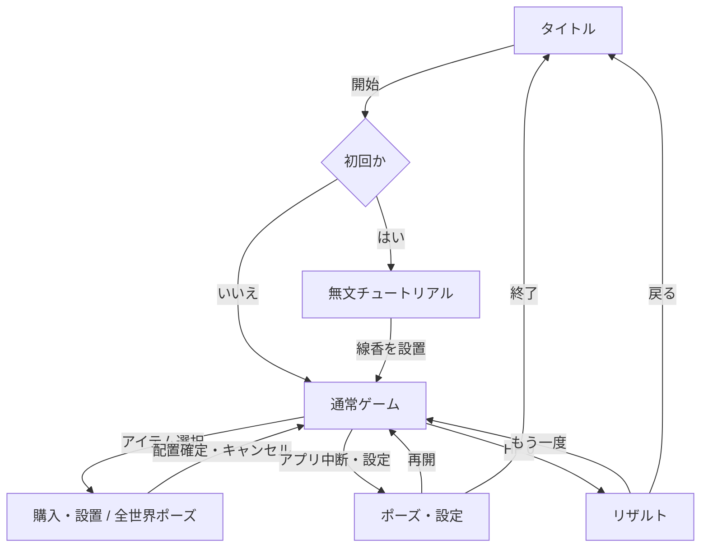
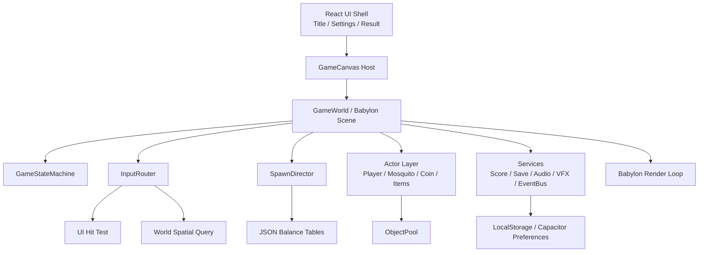
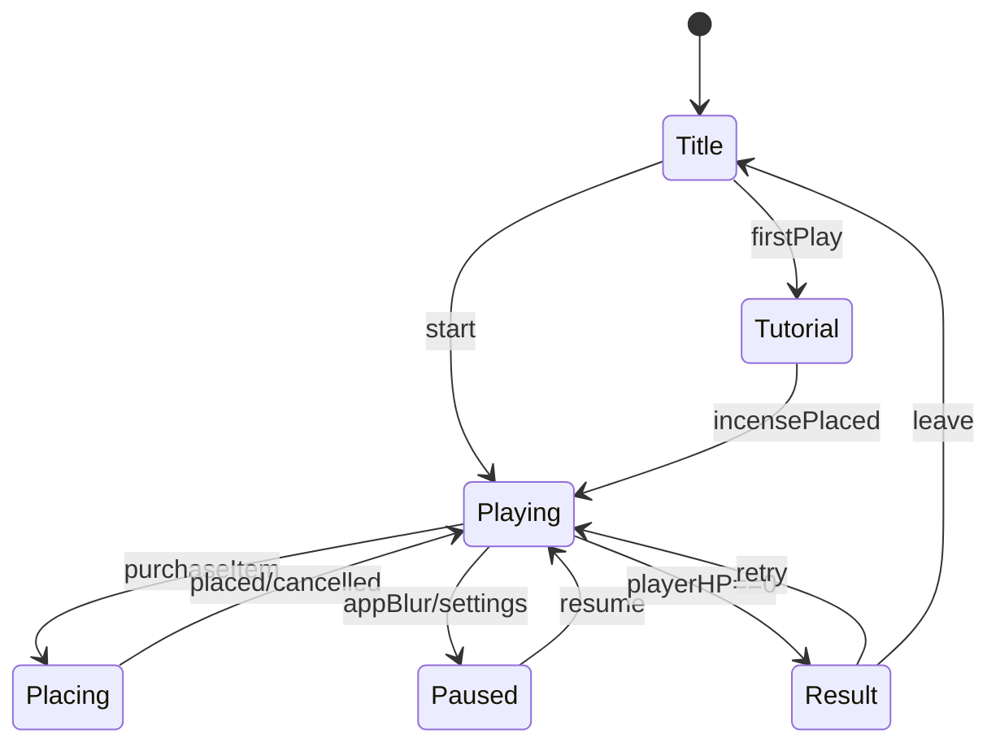
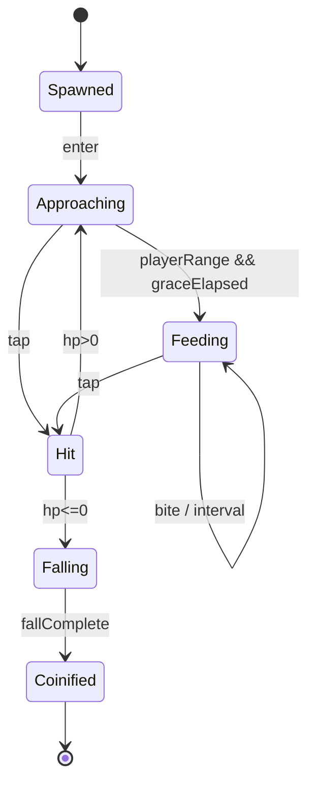
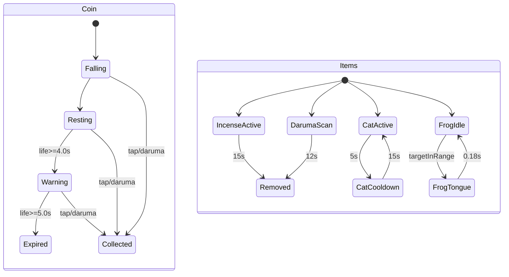

# 内蚊（ないか）— 新規スマホゲーム立ち上げドキュメント

> **作成日:** 2026-08-13 / **作成者:** Manus AI / **版:** 0.1（仮決定を含む）

## 0. 目次と作業方針

| 順序 | 範囲 | 作業方針 |
|---:|---|---|
| 1 | 成果物1：競合調査と差別化 | ストア・開発元の公開情報を根拠に、既知の成功パターンと未充足の体験を分離する。 |
| 2 | 成果物2：要件定義 | 差別化の核を、観測可能な画面・機能・数値へ落とす。 |
| 3 | 成果物3：システム設計 | Web/TypeScript/Babylon.js を前提に、疎結合で調整可能な構造を定義する。 |
| 4 | 成果物4：素材・制作運用 | MVPから公開版までに必要な画像・音声・外部ツール・権利確認を具体化する。 |

---

# 1. 成果物1：競合調査とオリジナリティ設計

## 1.1 調査条件と注記

調査日時点のストア表示値は地域・端末・時点により変動するため、ダウンロード数は **Google Playが公開する下限値**、評価は当該ページで確認できた値として記録する。初回配信年が公式ストアに明記されない小規模作品は、その旨を明記し、更新年を初回配信年の代用にはしない。比較表内の「弱点」はストア説明、公開レビュー、および本企画要件との差分から導いた【仮説】である。

## 1.2 競合・類似タイトル比較

| タイトル | 開発元 | プラットフォーム | リリース年 | コアループ | 操作方式 | 難易度カーブの作り方 | マネタイズ | 推定DL数とストア評価 | 優れている点 | 明確な弱点 |
|---|---|---|---:|---|---|---|---|---|---|---|
| Mosquito Smasher | 7 Brain Games | Android | 初回年非公表（2025年更新を確認） | 蚊を叩く→得点→能力を解放→次レベル | タップ | 複数レベルと能力解放 | 広告表示あり | 1K+、4.0/5・8件 [1] | 題材と操作が1文で伝わる。スプレーと自動撃破の発想も近い。 | 【仮説】日常の誰かを守る感情的な目的と、プレイ中の状態変化が弱い。 |
| Bug Smasher | Kyoz | Android | 初回年非公表（少なくとも2021年の公開レビューを確認） | 虫を叩く→HP維持→無限モードで得点とコイン | タップ | 敵の複数HP・速度上昇・偽死・触れてはいけない爆弾 | 広告あり | 100K+、4.1/5・445件 [2] | 3ハート、防衛失敗、敵ごとの例外、減速・領域殺傷アイテムがわかりやすい。 | 【仮説】虫・床・罠の一般化された演出で、世界観による継続動機が薄い。広告頻度への不満も公開レビューに見られる。 |
| Bug Heroes: Tower Defense | Foursaken Media | iOS / Android | 2025 | 英雄を選ぶ→資源回収→タワー設置→食料を防衛 | タップ中心の英雄操作＋設置 | ミッション、ボス、英雄・塔・グローバル強化 | 無料＋IAP [3] | 開発元は「ほぼ100万人」と告知、4.9/5と記載 [3] | 虫テーマと、手動アクション＋自動防衛を自然に接続している。 | 【仮説】編成・塔・強化が多く、1分前後で完結する初心者向け反射ゲームには重い。 |
| Plants vs. Zombies 2 | Electronic Arts | iOS / Android | 2013 | 植物を配置→ゾンビ侵攻を防ぐ→報酬で強化 | タップ配置 | 植物・敵・ワールド・無限ゾーン・アリーナ | 広告、IAP、ランダム要素を含む [4] | 100M+、4.1/5・744万件 [4] | 防衛レーン、設置の相性、理解しやすい敵の役割分担、長期コンテンツが強い。 | 【仮説】新規プレイヤーには収集・育成・イベントの説明量が大きく、短時間の即時満足とは別領域。 |
| The Battle Cats | PONOS | iOS / Android | 2012（日本）/ 2014（海外版） | ユニットを出す→拠点を守る→XP・宝で強化 | 1タップで出撃＋必殺砲 | ステージ、ユニット解放、進化、レア度、編成相性 | 広告、デジタル購入 [5] | 10M+、4.6/5・61.5万件 [5] | 「タップで出す」一操作を土台に、収集と戦略を長く積み重ねている。 | 【仮説】ガチャ・収集・ユニット知識が前提になり、初見での即時理解はアイテム数が増えるほど低下する。 |
| Survivor.io | Habby | iOS / Android / Windows | 2022 | 一手操作で回避→敵群を倒す→選択強化→次ウェーブ | 片手ドラッグ | 敵数・敵種・ステージ難度・ランダムスキル組合せ | 広告、IAP | 50M+、4.5/5・112万件 [6] | 1000体規模の脅威、即時の選択報酬、片手操作を両立させる。 | 【仮説】攻撃が自動化されるため、「自分の指で蚊を落とす」直接性は代替できない。長期成長は複雑化しやすい。 |
| Vampire Survivors | poncle | iOS / Android | 2022（モバイル） | 生存→経験値・金→武器選択→次ラン | 片手移動＋自動攻撃 | 時間経過で敵群を増加、選択の相乗、永続強化 | 無料＋IAP [7] | iOS 4.6/5・5.1K件 [7] | 失敗が必然でも、次回の成長と選択の手応えを残す。 | 【仮説】30分に達することもあるラン構造は、本企画の短い隙間時間ニーズより長い。 |
| Japanese Rural Life Adventure | GAME START LLC | iOS / iPadOS / macOS / tvOS（Apple Arcade） | 2023 | 田舎暮らし→季節行事・生活行動→修復・収集・進行 | タップ／仮想パッド／コントローラー | 季節・タスク・生活施設の段階解放 | Apple Arcade内、広告・IAPなし [8] | iOS 4.9/5・1.9万件 [8] | 日本の生活モチーフを季節・音・細部で魅力化し、海外にも14言語以上で届けている。 | 【仮説】生活シミュレーションのため、緊張から解放までを90秒で完結させる反射ゲームではない。 |

## 1.3 既に解かれている設計と、まだ埋まっていない隙間

| 観点 | 調査で確認できた事実 | 本企画への判断 |
|---|---|---|
| 直接タップの理解性 | Bug Smasherは「虫をタップ」「3ハート」「爆弾を避ける」という最小ルールで成立する [2]。 | **採用する。** ただし、失敗は単なる通過ではなく「眠る人の血を吸われる」視覚変化に置き換える。 |
| 自動防衛の役割 | Bug Heroes、PvZ2、Battle Catsはいずれも設置・出撃・自動攻撃を長期戦略に転換している [3][4][5]。 | **縮小して採用する。** 4種だけ、短い稼働時間、設置中は時を止めることで、反射ゲームの主導権を保つ。 |
| 群れによる圧力 | Survivor.ioとVampire Survivorsは、敵群の増加と選択報酬でプレッシャーを増幅する [6][7]。 | **採用する。** 敵数だけではなく「体が萎む」という可逆でない視覚的カウントダウンを追加する。 |
| 日本の日常の情緒 | Japanese Rural Life Adventureは、季節・生活音・習慣を継続理由にできることを示す [8]。 | **採用する。** 畳、簾、風鈴、麦茶、縁側、虫の声を、背景ではなく危険察知・緊張緩和のリズムに組み込む。 |
| 未充足の隙間 | 「1本の指で敵を直接落とす」「眠る身近な誰かを守る」「和の生活道具を短時間で置く」の三要素が同時に中心ループ化された競合は、上記調査では確認できない。 | **差別化の核にする。** ただし、蚊の不快感を強調し過ぎず、温かい防衛の感情に寄せる。 |

## 1.4 オリジナリティ候補の評価

| 案 | (a) 新しさ | (b) 気持ちよさ | (c) 実装コスト | (d) 模倣されにくさ | 判定 |
|---|---|---|---|---|---|
| 眠る人物が吸血で4段階に萎む「見た目HP」 | 数値HUDを身体表現に重ねる点が新しい。 | 守れている／危ないが一目で分かり、回復したい感情が生まれる。 | 中：差分スプライト4枚＋補間。 | 中：テーマと感情設計の結び付きが必要。 | **採用1位。** 中核コンセプトを最短で伝える。 |
| 和の生活道具4種を「短時間の防衛手段」として設置 | 線香・招き猫・蛙・達磨の役割対比が固有。 | 危機時に置く手が増え、配置直後に状況が反転する。 | 中：領域・誘引・ターゲット・自動回収の4ロジック。 | 高：道具の意味、モーション、演出を合わせる必要がある。 | **採用2位。** 継続プレイの選択幅を作る。 |
| 購入中だけ月白の「時を止める和室」になる | 反射ゲームと軽戦略を誤操作なく接続する。 | 緊張から一拍置き、次の一手を自分で決められる。 | 低：ゲーム時間・スポーン・AIを同一PauseGroupで止める。 | 中：UIだけでなくテンポ設計に依存。 | **採用3位。** 初心者対応と差別化を同時に満たす。 |
| 羽音を空間化して敵の方角・距離を知らせる | 音を雰囲気ではなくプレイ情報にする。 | 画面を見切れない時にも先回りできる。 | 中：Web Audioのパン・距離減衰、同時発音制御。 | 中：ミュート時の代替が必要。 | **v1.0へ採用。** MVPでは視覚予兆を優先する。 |
| 夏夜の出来事を毎晩1つだけ追加する「夜更け図鑑」 | 美術収集と日替わりを軽量に結ぶ。 | 新しい風鈴、花火、夕立後などを見たい気持ちになる。 | 中：イベント表・背景差分・通知。 | 中：運用が継続価値を左右する。 | **v1.1以降。** MVPのコアループ検証を遅らせるため見送る。 |
| 眠る人物の正体を選ぶ短編エピソード | 守る理由を増やす。 | 感情移入を強められる。 | 高：人物絵、台詞、ローカライズ。 | 高：物語資産が必要。 | **見送り。** 初期の「誰でも守りたい寝息」という普遍性を損なう恐れがある。 |

## 1.5 コンセプトステートメント案

| 案 | ステートメント | 評価 |
|---:|---|---|
| A | **夏の和室で、眠るひとりの寝息を、指先と暮らしの道具で朝まで守るハイスコア防衛アクション。** | **採用。** 主語・場所・操作・目的・ジャンルを1文に含む。 |
| B | 蚊を落とし、灯を置き、萎んでいく寝息を取り戻せ。 | タイトルコピー向け。危機と行動は強いが、ゲーム形式が分かりにくい。 |
| C | 静かな夏夜ほど、蚊は近い。 | キービジュアル向け。情緒は強いが、プロダクト定義には不足する。 |

## 1.6 想定ターゲットと遊ぶ動機

| 区分 | 人物像 | 利用状況 | 遊ぶ動機 | 設計上の含意 |
|---|---|---|---|---|
| プライマリ | 20〜39歳、日本のカジュアル／パズル／放置ゲーム経験者。和の生活モチーフに親しみがある人。 | 就寝前、通勤待ち、休憩中の1〜3分。 | 考え込まずに指を動かす満足、短時間の緊張と解放、夏の情緒。 | 初回20秒でタップ→撃破→コイン→設置まで到達させる。縦持ち・片手を前提にする。 |
| セカンダリ | 海外のcozy game・日本文化・小動物／雑貨好き。 | 音を出せない場所、短い空き時間。 | 日本の夏夜という新鮮な舞台、アイコン的な道具、簡単な収集。 | 英語を初期対応。文字に依存せず、視覚・色・アイコンで理解させる。 |

## 1.7 失敗要因と回避策

| リスク | 失敗のメカニズム | 早期検知指標 | 回避策 |
|---|---|---|---|
| 蚊が不快で遊び続けにくい | 不快さの描写が「倒して気持ちよい」を上回る。 | チュートリアル離脱率、初回30秒離脱率。 | 蚊は黒い小虫としてデフォルメし、吸血は血液表現ではなく体格と寝息で示す。 |
| 反射ゲームが単調になる | タップ対象の速度だけを上げると疲労が先行する。 | 3プレイ目以降の平均プレイ時間低下。 | 4種の役割が異なるアイテム、敵タイプ、15秒ごとの小目標を導入する。 |
| アイテム購入がテンポを壊す | 選択UIが長く、敵を見失う。 | 購入開始から再開までの中央値が4秒超。 | 購入中は完全停止、推奨1件を先頭表示、設置可能領域だけを明示する。 |
| 広告が情緒を壊す | 1〜2分の短いプレイに対して強制広告が過剰。 | リワード広告視聴率低、ストア低評価に広告言及。 | MVPは広告なし。公開版もゲームオーバー後の任意リワードに限定し、1セッション1回上限にする。 |
| 和風表現が記号化・誤読される | 道具の意味が海外プレイヤーに伝わらない。 | 英語圏テストでアイテム使用率の偏り。 | 絵だけで機能が伝わるシルエットと短い動作を先に作り、名称は補助に留める。 |

## 1.8 初期KPI仮説

公開ベンチマークでは、全市場・全ジャンルを含む中央値として D1 22.91%、D7 4.2% が報告されている [9]。本企画は短時間カジュアルとして、その中央値を上回るが「大型ライブサービス級」の数値は初期ゲートにしない。

| 指標 | 仮説目標 | 測定定義 | 根拠と判断 |
|---|---:|---|---|
| 想定1プレイ時間 | 90〜150秒 | タイトルから結果確定まで。チュートリアル初回は除外。 | 就寝前・待ち時間に再試行しやすく、手の疲労を溜めない長さ。 |
| D1継続率 | 35%以上 | 初回インストール翌日に1プレイ以上。 | 全体中央値22.91% [9] より高い、テーマ性と即時理解を検証する最低線。 |
| D7継続率 | 10%以上 | 初回インストールから7日目に1プレイ以上。 | 全体中央値4.2% [9] を上回り、アイテム選択とハイスコアの再訪を示す線。 |
| 初回完走率 | 70%以上 | 初回プレイでコイン回収と1回のアイテム設置を経験。 | 説明文でなく操作によるチュートリアルが成立したかを見る。 |
| リワード広告視聴率（v1.0以降） | DAUの12〜20% | 結果画面の任意広告を1回以上視聴。 | 強制広告を置かず、コンティニューまたは一時スコア2倍の価値で測る。 |
| LTVの考え方 | 初期は広告ARPDAU + IAP粗利で 30日LTV ¥45〜¥90 を仮置き | コホート別の広告収益＋課金粗利−UA費。 | MVPでLTVを最適化せず、D1/D7と初回完走率を通過後に広告頻度・コスメティックをAB検証する。 |

---

# 2. 成果物2：要件定義書

## 2.1 プロダクト定義

| 項目 | 定義 |
|---|---|
| プロダクト名 | **内蚊（仮）**。英語仮称は **Night Guard: Mosquito**。 |
| コンセプト | 夏の和室で、眠る人物の寝息を守る、縦持ち・片手・90〜150秒のタッチ防衛ハイスコアゲーム。 |
| ターゲット | 1.6のプライマリ／セカンダリ。ゲーム経験の少ない人が初回1分で操作を理解できることを最優先とする。 |
| 提供価値 | 直接タップの即時手応え、和の道具による短い戦略、人物の見た目HPによる「守れた」感情、夏夜の音と画。 |
| 成功指標 | D1 35%以上、D7 10%以上、初回完走率70%以上、平均プレイ90〜150秒。 |
| マネタイズ仮決定 | MVPはなし。v1.0で任意リワード広告と「広告除去＋季節背景」買い切りを検証し、ガチャとゲーム進行を阻害する強制広告は採用しない。 |
| オンラインランキング仮決定 | MVPは端末内ハイスコアのみ。v1.0で日替わりスコアランキングを検討する。 |

## 2.2 対応環境

| 項目 | MVP要件 | v1.0要件 | 設計理由 |
|---|---|---|---|
| OS | iOS 16+、Android 10+、モバイルWeb | iOS / Androidストア配信 | 近年のWebView性能を前提に2D描画の品質を安定させる。 |
| 端末世代 | iPhone 11 / Snapdragon 730G / 4GB RAM相当以上 | iPhone SE（第2世代）を含む | 60FPSを最低品質設定で確認する下限を明確にする。 |
| 画面・向き | 9:16基準、縦持ち固定。安全領域は上64dp・下44dpを確保。 | 19.5:9〜20:9、タブレットは中央9:16レター・ボックス。 | 片手タップと、蚊の侵入方向を縦構図で固定する。 |
| オフライン | 初回アセット取得後は完全オフラインで1プレイ可能。 | ランキング・広告以外はオフライン。 | 寝室・移動中の利用に接続を要求しない。 |
| 入力 | 単指タップを必須、2点マルチタップは許可。 | 触覚・アクセシビリティ設定。 | 同時にコインと蚊が出た時の誤操作を仕様化する。 |

## 2.3 機能要件（MoSCoW）

| 優先度 | 要件 | 受入条件 |
|---|---|---|
| Must | 蚊の出現→接近→吸血→被弾→落下→コイン化 | 各状態が画面上で識別でき、撃破からコイン化まで0.6秒以内に完了する。 |
| Must | プレイヤーの体力と見た目変化 | HP 100/75/50/25/0 の5閾値で、体格・寝息・顔色を段階表示し、HP0で結果へ遷移する。 |
| Must | タッチ入力 | 蚊の当たり判定は視覚外接矩形を各辺+12dp、最小48×48dp。UI > コイン > 蚊の優先順で解決する。 |
| Must | コインの落下・回収・消滅予兆 | 撃破位置から下方最大72dpに落下し、4.0秒後に点滅開始、5.0秒で消滅する。 |
| Must | アイテム購入UI | 購入可能時にアイテムボックスが灯橙で発光し、購入後から設置確定までゲーム時間・AI・スポーンを停止する。 |
| Must | 線香／招き猫／蛙／達磨 | 2.4の価格・効果・上限で実装し、終了条件を視覚と音で通知する。 |
| Must | スコア、端末内ハイスコア、リザルト | 現在スコア、最高値、撃破数、最長コンボ、獲得コインを表示し、ハイスコア更新を別演出する。 |
| Must | 時間ベース難易度進行 | 0〜30秒、30〜60秒、60〜120秒、120秒以降のスポーンテーブルを切り替える。 |
| Must | サウンド・VFX・振動 | 命中、空振り、吸血、コイン、購入、アイテム発動、ゲームオーバーを実装。振動は設定で無効化できる。 |
| Must | 無文チュートリアル | 最初の10秒で、出現した1匹をタップし、落ちたコインをタップし、発光枠から線香を選んで置くまで誘導する。説明文は各15文字以内、スキップ可能。 |
| Should | 敵3種と、敵ごとのシルエット／速度／HP | 30秒以内に標準種、60秒以内に速種、90秒以内に硬種を体験させる。 |
| Should | ミュート・触覚・色覚補助設定 | 効果音、環境音、BGM、振動を分離し、危険には色以外に輪郭・アイコンを付ける。 |
| Should | ポーズ・再開 | アプリ非アクティブ化で自動停止し、再開時は3・2・1で再開する。 |
| Could | 日替わり背景と端末内実績 | 連続撃破・特定アイテムでの撃破など、プレイを強制しない目標を与える。 |
| Could | オンライン日替わりランキング | スコア署名・異常検知を伴うバックエンド導入後に限定する。 |
| Won't（MVP） | キャラクターガチャ、対人対戦、ギルド | 短時間防衛の核、初回理解、オフライン性を損なうため初期スコープ外とする。 |

## 2.4 初期ゲームバランス設計値

### 2.4.1 プレイヤー・吸血・敵パラメータ

| 区分 | 名前 | HP／必要タップ数 | 移動速度 | 出現重み（序盤／中盤／終盤） | 吸血開始まで | 吸血間隔 | 1回ダメージ | 撃破スコア | コイン |
|---|---|---:|---:|---|---:|---:|---:|---:|---:|
| プレイヤー | 眠る人 | 最大HP 100 | — | — | — | — | — | — | — |
| 敵A | ちび蚊 | 1 | 100dp/s | 70 / 50 / 35 | 2.0秒 | 2.2秒 | 6 | 100 | 1 |
| 敵B | すばやい蚊 | 1 | 165dp/s | 20 / 35 / 40 | 1.4秒 | 1.8秒 | 7 | 160 | 1 |
| 敵C | しぶとい蚊 | 2 | 82dp/s | 10 / 15 / 25 | 2.6秒 | 2.0秒 | 9 | 260 | 2 |
| 敵D | 大蚊（v1.0） | 3 | 70dp/s | 0 / 0 / 10 | 3.0秒 | 1.6秒 | 12 | 450 | 3 |

体力の見た目段階は、HP 76〜100を健康、51〜75を軽度、26〜50を中度、1〜25を重度、0をゲームオーバーとする。被吸血直後の0.25秒は対象蚊の腹部を灯橙にし、人物に朱色の小さな波紋を出す。数値ダメージ表示は出さない。

### 2.4.2 出現・コイン・アイテム・スコア

| 項目 | 0〜30秒 | 30〜60秒 | 60〜120秒 | 120秒以降 | 設計意図 |
|---|---:|---:|---:|---:|---|
| 同時蚊上限 | 4 | 6 | 8 | 10 | 低スペックでも読み取れる上限で、量より役割の掛け合わせで圧を作る。 |
| 基本スポーン間隔 | 2.8秒 | 1.8秒 | 1.2秒 | 0.85秒 | 反応時間をいきなり縮めず、設置物の価値を段階的に上げる。 |
| 速種出現解禁 | — | 35秒 | 継続 | 継続 | 1タップの成功体験後に導入する。 |
| 硬種出現解禁 | — | — | 65秒 | 継続 | 連打と範囲効果の学習を促す。 |

| 項目 | 初期値 | 受入条件 |
|---|---:|---|
| コイン落下位置 | 撃破座標からX±28dp、Y+48〜72dp | 画面外に落ちず、人物の上に重なっても回収できる。 |
| コイン滞留／予兆／消滅 | 4.0秒／4.0〜5.0秒は3Hz点滅／5.0秒 | 点滅時は色だけでなく拡縮0.92〜1.05を併用する。 |
| コイン価値 | 1コイン | 1プレイで通常6〜18コインが得られる。 |
| 蚊取り線香 | 価格6、15秒、半径120dp、最大1、畳の空き領域に設置 | 煙の領域へ0.25秒滞在した蚊を撃破。線香渦は15秒で時計回りに減る。 |
| 招き猫 | 価格8、5秒稼働＋15秒クールダウン、最大1 | 半径170dp内の非吸血蚊の目標を猫へ変更。猫到着後は1.0秒停止して再進路。 |
| カエル | 価格14、常時、最大1、人物から64dp以上離す | 半径140dp内で最も人物に近い蚊を、1.8秒に1回、舌で即時撃破。 |
| ダルマ | 価格10、12秒、最大1 | 半径220dp内のコインを0.35秒ごとに1枚回収。 |
| 基本スコア | 100×敵係数 | ちび1.0、速1.6、硬2.6、大4.5。 |
| コンボ | 撃破間隔3秒以内で+1、最大20 | `獲得点 = 基本スコア × (1 + min(combo,20)×0.05)`。吸血成功でコンボは0。 |
| 想定ゲームオーバー | 初心者：75〜120秒／慣れた人：150〜240秒 | 初回で1回以上アイテムを置き、熟練で120秒壁を越えられる。 |

## 2.5 非機能要件

| 項目 | 要件 | 測定方法 |
|---|---|---|
| フレームレート | 下限端末で通常時60FPS、最悪時45FPSを下回る連続時間は500ms未満。 | Dev HUDで実機10プレイ、p95フレーム時間を記録。 |
| 同時表示上限 | 蚊10、コイン12、煙粒子40、衝撃VFX12、UIは固定。 | プール利用中数をHUDに表示。 |
| 起動 | タイトル表示まで4秒以内（4G相当キャッシュ済み）、再起動2秒以内。 | Lighthouse／実機動画で計測。 |
| メモリ | JSヒープ120MB以下、テクスチャ総量36MB以下。 | Chrome Performance / Safari Web Inspector。 |
| バッテリー | 15分プレイで端末電池消費6%以下を目標。 | 実機の省電力／標準品質別に測定。 |
| 容量 | 初期Webバンドル3MB gzip以下、初期音声・画像を含むキャッシュ20MB以下。 | ビルド成果物で確認。 |
| アクセシビリティ | タップ領域48dp以上、色以外の危険記号、振動・音量の個別設定、縮小モーション。 | 設定ON/OFF、色覚シミュレータ、TalkBack/VoiceOverの最低限ラベルで確認。 |
| 言語 | 初期：日本語・英語。v1.1候補：簡体字中国語・韓国語。 | テキストはJSON辞書へ外出し、1行上限をUIで検証。 |

## 2.6 画面一覧と画面遷移

| 画面 | 役割 | 主な要素 | 遷移条件 |
|---|---|---|---|
| タイトル | 世界観提示と開始 | ロゴ、寝息、開始、設定、最高点 | 画面タップでチュートリアルまたはゲーム。 |
| チュートリアルゲーム | 無文の基本学習 | 1蚊、1コイン、線香誘導 | 線香設置後に通常ゲームへ。 |
| 通常ゲーム | コアループ | スコア、HP、コイン、アイテム枠、世界 | HP0、ポーズ、購入。 |
| 購入・設置 | 停止中に道具を選ぶ | 選択カード、ゴースト配置、キャンセル | 設置またはキャンセルでゲームへ。 |
| ポーズ・設定 | 中断・設定 | 再開、音量、振動、終了 | 再開／タイトル。 |
| リザルト | 振り返りと再試行 | 点数、最高点、撃破、コンボ、再戦 | 再戦／タイトル。 |



## 2.7 スコープ分割

| 範囲 | 含めるもの | 明確に含めないもの |
|---|---|---|
| MVP | タイトル、無文チュートリアル、プレイヤーHP・4見た目段階、蚊A/B/C、コイン、線香・招き猫・蛙・達磨、端末内ハイスコア、設定、基礎音、90秒バランス。 | オンライン、広告、IAP、日替わり、実績、蚊D、季節差分。 |
| v1.0 | 高品質アニメ・全音声、蚊D、達成目標、任意リワード広告、広告除去IAP、クラッシュ／分析、ストア素材。 | リアルタイム対戦、ギルド、ガチャ。 |
| v1.1以降 | 日替わり夏夜、端末内図鑑、オンラインランキング、追加道具、追加人物背景。 | 物語型キャンペーンを大規模に増やすこと。 |

## 2.8 技術スタック比較と推奨

| 候補 | 開発速度 | 2Dアニメ表現 | タッチ精度 | 実機性能 | 配信・更新 | 学習コスト | ストア配信 | AI生成アセット相性 | 費用 | 判断 |
|---|---|---|---|---|---|---|---|---|---|---|
| **TypeScript + Babylon.js + Reactホスト + Capacitor** | 高 | 高：Tween、パーティクル、正投影2D | 高：Canvasポインタ座標を直結 | 高：オブジェクトプール前提 | 高：Web即時更新、Capacitorでネイティブ化 | 中 | 可 | 高：PNGをテクスチャとして直接利用 | OSS中心 | **推奨。** 今回はWebで即時検証し、後からiOS/Androidへ包装できる。Babylon.jsは豊富なAPIを提供し [10]、CapacitorはWeb技術でネイティブ実行を可能にする [11]。 |
| TypeScript + Phaser 3 + Capacitor | 高 | 高：2D専用エコシステムが豊富 | 高 | 高 | 高 | 低〜中 | 可 | 高 | OSS中心 | **次善。** 2Dだけを見れば自然だが、現行実装基盤はBabylon.jsのライフサイクル検証を採るため切替コストがある。 |
| Unity 6 + C# | 中 | 非常に高：Animator、Timeline、Addressables | 高 | 非常に高 | 中：ストア更新主体 | 中〜高 | 非常に高 | 高 | 無料枠／商用条件確認要 | 本格運用・広告SDK・アセット規模拡大には強い。公開情報ではモバイルゲームの70%以上がUnity製とされる [12] が、MVPのWeb試作には重い。 |
| Godot 4 + GDScript/C# | 中 | 高 | 高 | 高 | 中 | 中 | 高 | 高 | OSS | ライセンス面で有力な次々善。チームにGodot経験者がいる場合は選択肢。 |
| Flutter + Flame | 中 | 中〜高 | 高 | 中〜高 | 高 | 中 | 可 | 高 | OSS | Flutterアプリとゲームを同居させる場合に有力。FlameはFlutter上のゲームエンジンとして提供される [13] が、描画の自由度とゲーム固有ノウハウは今回の選定より一段下。 |

> **推奨判断:** 本案件は、まずブラウザで「タップの手触り」「画面の情報密度」「90秒の難易度」を実測する。そのため、**TypeScript + Babylon.js + Reactホスト + Capacitor** を採る。ゲームロジックはReactから完全分離し、正投影カメラと2Dスプライト的な構成を採用する。ストア審査・広告SDK・複数人開発に拡大し、60FPS維持に課題が出た時だけUnity移管を評価し直す。

## 2.9 開発ロードマップ

| 週 | マイルストーン | 検証ポイント | 完了基準 |
|---:|---|---|---|
| 1 | 企画固定、操作グレーボックス、タップ命中 | 48dp判定、入力優先順位、端末縦持ち。 | 1蚊をタップで落下できる。 |
| 2 | 吸血、HP、見た目変化、コイン | 1プレイ目で危機が伝わるか。 | HP0まで一貫してプレイできる。 |
| 3 | 4アイテムと購入ポーズ | 設置中に敵が動かず、選択が3秒以内に完了するか。 | 4アイテムの終了条件が見える。 |
| 4 | 敵3種、スポーン、コンボ、初期バランス | 初心者75〜120秒、慣れた人150秒超。 | 20人プレイテストで初回完走70%。 |
| 5 | アート・音・触覚・無文チュートリアル | 蚊が背景に埋もれないか、ミュートでも理解できるか。 | 60FPS、チュートリアル完走70%。 |
| 6 | 設定、保存、リザルト、分析イベント | イベント欠損、復帰、端末差異。 | クラッシュなしで100連続プレイ。 |
| 7 | v1.0候補（広告、追加蚊、ストア素材） | 広告がテンポを阻害しないか。 | リワード広告の任意性をAB検証。 |
| 8 | ソフトローンチ、KPI判定 | D1/D7、初回完走、平均プレイ。 | KPI未達なら広告前にコア体験を修正。 |

---

# 3. 成果物3：システム設計書

## 3.1 全体アーキテクチャ



| レイヤ | 責務 | 禁止事項 |
|---|---|---|
| Reactホスト | Canvasの生存管理、タイトル／設定／リザルトのDOM、アクセシブルな設定UI。 | ゲームフレームごとの状態をReact stateに置かない。 |
| GameWorld | シーン生成、更新順序、サービス接続、破棄。 | 個別の蚊やUIカードのルールを持たない。 |
| ドメインオブジェクト | 蚊、人物、コイン、アイテムの状態と振る舞い。 | DOMやLocalStorageへ直接アクセスしない。 |
| サービス | 保存、音、VFX、スコア、イベント配信。 | フレームループの所有者にならない。 |
| データ | JSON化したバランス・ローカライズ・イベント名。 | 調整値をゲームクラスの条件分岐に埋めない。 |

## 3.2 ゲームループ設計

更新は **可変フレームの描画 + 1/60秒固定タイムステップ** とする。`accumulator` に経過時間を加え、1フレームで最大3ステップまでシミュレーションし、バックグラウンド復帰時の暴走を防ぐ。購入・設置中は `simulationScale = 0` にして、スポーン、AI、移動、領域効果、コイン寿命、コンボタイマーを全て止める。一方でUIのホバー・選択アニメーションだけは実時間で動かす。

| 順序 | 処理 | 補足 |
|---:|---|---|
| 1 | 入力キューを消費 | UIが命中すれば世界への入力を中止。次にコイン、最後に蚊。 |
| 2 | 状態遷移とスポーン | ゲーム状態がPlayingの場合だけ、時間テーブルから生成する。 |
| 3 | AI意思決定 | 蚊の目的地、招き猫の誘引、蛙のターゲット選定。 |
| 4 | 移動 | 蚊、コイン、落下、舌、煙粒子を固定dtで更新。 |
| 5 | 衝突／領域照会 | 人物接触、煙半径、蛙射程、達磨回収半径。 |
| 6 | 効果適用 | ダメージ、撃破、吸血、コイン化、アイテム終了。 |
| 7 | スコア・イベント | コンボ、所持コイン、ハイスコア候補、音／VFXイベント。 |
| 8 | 描画補間 | 前フレームと現フレームの補間値をBabylonノードへ反映。 |

## 3.3 主要クラス／コンポーネント

| クラス | 責務 | 公開API | 主な状態 |
|---|---|---|---|
| GameManager / GameStateMachine | タイトル、チュートリアル、プレイ、設置、ポーズ、リザルトを遷移。 | `startRun()`, `pause(reason)`, `resume()`, `endRun()` | `state`, `runTime`, `simulationScale` |
| SpawnDirector | 難易度テーブルに基づく敵選定・出現上限・次回生成。 | `tick(dt)`, `forceSpawn(type)` | `phase`, `nextSpawnAt`, `activeCounts` |
| Mosquito | 敵個体の状態・移動・被弾・コイン化前の振る舞い。 | `hit()`, `redirect()`, `update()` | `type`, `hp`, `state`, `target`, `position` |
| Player | HP、見た目段階、被吸血、死亡。 | `applyBite(amount)`, `getVisualStage()` | `health`, `visualStage`, `isDead` |
| Coin | 落下、滞留、点滅、消滅、回収。 | `collect()`, `update()` | `life`, `phase`, `value`, `position` |
| ItemBase | 設置物の共通ライフサイクル。 | `place()`, `tick()`, `dispose()` | `id`, `active`, `duration`, `radius` |
| Incense | 煙の領域ダメージ。 | `contains(point)` | `smokeRadius`, `remaining`, `coilProgress` |
| BeckoningCat | 非吸血蚊の誘引とクールダウン。 | `canAttract(mosquito)` | `activeRemaining`, `cooldownRemaining` |
| Frog | 近接優先の自動撃破。 | `selectTarget()`, `tongueHit()` | `attackCooldown`, `targetId` |
| Daruma | コインの自動回収。 | `findCoin()` | `scanCooldown`, `radius` |
| InputRouter | ポインタ座標の正規化、UI優先判定、世界ヒット。 | `enqueuePointer()`, `resolve()` | `queue`, `lastPointer` |
| ShopController / ItemBoxUI | 購入可能通知、購入、ゴースト配置、キャンセル。 | `open()`, `buy()`, `confirmPlacement()` | `selectedItem`, `isPlacing`, `wallet` |
| ScoreService / SaveService | スコア計算、ローカル保存、設定保存。 | `addKill()`, `saveProfile()` | `score`, `combo`, `profile` |
| AudioService / VfxService | 音量グループ、発音数、振動、視覚イベント。 | `play()`, `spawn()` | `voices`, `settings`, `quality` |
| ObjectPool | 蚊・コイン・VFXの再利用。 | `acquire()`, `release()` | `free`, `active`, `capacity` |

## 3.4 状態遷移







## 3.5 イベント設計

| Event | Publish | Subscribe | payload | 疎結合の意図 |
|---|---|---|---|---|
| `mosquito.hit` | Mosquito | VfxService, AudioService, ScoreService | `id, point, remainingHp` | 敵は音・スコアの実装を知らない。 |
| `mosquito.killed` | Mosquito | SpawnDirector, ScoreService, CoinFactory, VfxService | `type, point, comboEligible` | 撃破後の生成・報酬を個体から切り離す。 |
| `player.bitten` | Player | UI HUD, VfxService, AudioService, GameManager | `damage, health, stage` | 見た目と終了判定を分離する。 |
| `coin.collected` | Coin | Wallet, ScoreService, AudioService | `value, source` | ダルマと手動回収を同じ報酬経路へ寄せる。 |
| `item.placed` | ShopController | GameManager, AudioService, Analytics | `itemId, point, price` | ポーズ解除・分析を購入UIから分離する。 |
| `run.ended` | GameManager | SaveService, ResultUI, Analytics | `score, duration, kills` | リザルトのUI差し替えが可能になる。 |

## 3.6 データ設計

バランス値は `client/src/game/data/*.json` に置き、起動時にZodで検証する。JSONは非機密であるため、ランキング導入時の最終スコアだけはサーバー側で再検証する。端末内ハイスコアは改ざん防止の対象ではなく、ストア用ランキングに転用しない。

```json
{
  "mosquitoes": [
    {"id":"small","hp":1,"speedDpS":100,"biteDamage":6,"score":100,"coin":1,"weights":[70,50,35]},
    {"id":"fast","hp":1,"speedDpS":165,"biteDamage":7,"score":160,"coin":1,"weights":[20,35,40]},
    {"id":"sturdy","hp":2,"speedDpS":82,"biteDamage":9,"score":260,"coin":2,"weights":[10,15,25]}
  ],
  "items": [
    {"id":"incense","price":6,"durationS":15,"radiusDp":120,"maxPlaced":1},
    {"id":"cat","price":8,"activeS":5,"cooldownS":15,"radiusDp":170,"maxPlaced":1},
    {"id":"frog","price":14,"attackEveryS":1.8,"radiusDp":140,"maxPlaced":1},
    {"id":"daruma","price":10,"durationS":12,"radiusDp":220,"maxPlaced":1}
  ],
  "difficulty": [
    {"fromS":0,"toS":30,"spawnEveryS":2.8,"maxActive":4},
    {"fromS":30,"toS":60,"spawnEveryS":1.8,"maxActive":6},
    {"fromS":60,"toS":120,"spawnEveryS":1.2,"maxActive":8},
    {"fromS":120,"toS":9999,"spawnEveryS":0.85,"maxActive":10}
  ]
}
```

```ts
export interface SaveProfile {
  schemaVersion: 1;
  highScore: number;
  totalCoins: number;
  settings: { bgm: number; sfx: number; ambience: number; haptics: boolean; reducedMotion: boolean };
  achievements: Record<string, { unlockedAt: number }>;
}
```

| 保存対象 | 保存先 | 改ざん耐性 | 方針 |
|---|---|---|---|
| ハイスコア・設定・実績 | `localStorage`（Web）、Capacitor Preferences（ネイティブ） | 低 | 端末内の楽しみ用。破損時はデフォルトへ安全に戻す。 |
| オンラインランキング（v1.1） | 認証付きバックエンド | 中〜高 | 乱数seed、入力ログ要約、最大得点境界を署名してサーバー検証。 |

## 3.7 当たり判定・入力設計

| 項目 | 値・ルール | 理由 |
|---|---|---|
| 最小タップ領域 | 48×48dp、視覚矩形が小さければ中心から24dp半径の円。 | 指腹とモバイルOSの推奨ターゲットを踏まえ、細い蚊でも狙えるようにする。 |
| 視覚からの拡張 | 蚊外接矩形の上下左右に12dp。コインは半径28dp。 | 指先が蚊を隠すため、見た目と判定を一致させ過ぎない。 |
| 重なり優先度 | UI > コイン > 蚊 > 背景。蚊同士は人物に近い個体を優先。 | 取り逃しや、購入カードを押したつもりで蚊を倒す事故を減らす。 |
| 連打 | 1ポインタあたり最短40ms、同一蚊への有効命中は80msクールダウン。 | ブラウザの多重イベントによる意図しない多段ダメージを避ける。 |
| マルチタッチ | 最大2点を独立処理。UIで指が置かれている間、世界入力をブロック。 | コイン回収と蚊撃破の並行を許可しつつ、購入誤操作を防ぐ。 |
| 煙・蛙・達磨 | 円領域の距離二乗判定。候補はアクティブ蚊10／コイン12まで。 | `sqrt`を不要にし、毎fixed stepでも計算コストを予測可能にする。 |

## 3.8 演出・アニメーション設計

| 対象 | 表現 | 実装手段 | 採用理由 |
|---|---|---|---|
| 人物の萎み | 4差分スプライト＋Scale Y 0.98→0.94の0.25秒補間。呼吸振幅を段階で減少。 | スプライト差分＋Tween | 骨のない寝姿でもシルエット変化を明確にできる。 |
| 線香 | 渦の角度マスクを15秒で減らし、煙8〜16粒子を上昇・拡散。 | シェーダまたは円弧メッシュ＋粒子 | 残り時間を数字なしで提示する。 |
| 招き猫 | 0.6秒周期で前足を-18〜+18度、鈴を+/-6dp。 | Tween | 小さくても「稼働中」が読める。 |
| 蛙の舌 | 0.18秒でBezier状に往復、命中時に蚊を縮小。 | Line/mesh＋Tween | 高価アイテムの強い瞬間を作る。 |
| 風鈴・簾・星 | 風鈴2.8秒、簾4.2秒、星1.6〜3.4秒の位相ずらし。 | Tween | 背景の生き物感を作るが、ゲーム情報より弱くする。 |
| 命中 | 0.12秒の停止、墨の放射線、短い回転、軽い振動。 | VFXプール＋Tween＋Haptics | タップ結果を100〜160ms内に返す。 |

## 3.9 パフォーマンス設計

| 対象 | 上限／方法 | 低品質設定 |
|---|---|---|
| オブジェクト | 蚊10、コイン12、設置物4、VFX12、煙40。全てプール。 | 煙を16粒子、VFXを6に減らす。 |
| 描画 | 同一マテリアル・テクスチャをバッチ化、正投影カメラ、透明レイヤはZ順固定。 | 背景の紙粒子と前景簾の半透明を無効化。 |
| パーティクル | 1回の命中で最大8、同時12。画面外は更新停止。 | 命中の粒子を3、星の瞬きを停止。 |
| 動的解像度 | FPSが50未満の連続2秒で内部解像度0.85、60FPS連続10秒で復帰。 | デバイス品質設定を保存。 |
| GC抑制 | フレーム内の配列生成、クロージャ生成、文字列連結を禁止。イベントpayloadは再利用可能な小オブジェクト。 | Dev HUDでalloc警告。 |

## 3.10 ディレクトリ構成と命名規則

```text
client/src/
  components/GameCanvas.tsx
  game/
    scene.ts
    GameWorld.ts
    core/{GameStateMachine,EventBus,ObjectPool,FixedStep}.ts
    entities/{Mosquito,Player,Coin}.ts
    items/{ItemBase,Incense,BeckoningCat,Frog,Daruma}.ts
    systems/{SpawnDirector,InputRouter,ScoreService,SaveService,AudioService,VfxService}.ts
    data/{balance.json,locales.ja.json,locales.en.json}.ts
    render/{SpriteFactory,LayerConfig,Effects}.ts
    test/{balance.spec,score.spec,spawn.spec}.ts
docs/
  naika_game_launch_document.md
```

クラス名はPascalCase、ファイル名はクラス名と一致、データJSONはkebab-case、イベント名は `domain.verb` のdot caseとする。`MosquitoType`、`ItemId`、`GameState` のユニオン型をドメインの共通語彙として使う。

## 3.11 テスト戦略

| 種別 | 対象 | 検証内容 |
|---|---|---|
| 単体 | スコア式、コンボリセット、スポーン重み、価格、アイテム終了、保存migration | 同一seedで同一結果、価格不足で購入不可、HP下限0。 |
| 統合 | 入力優先順位、ポーズ、撃破→コイン、コイン→所持金、ゲームオーバー→保存 | 購入中にスポーン・寿命・攻撃が進行しない。 |
| バランスデバッグ | 0.5/1/2/4倍速、無敵、コイン+10、強制スポーン、当たり判定可視化、種別重み表示 | 実機テスト中に不具合を再現できる。 |
| 実機 | iPhone SE 2 / iPhone 13 / Android 730G / Android 8 Gen 1以上 | セーフエリア、触覚、音声解放、復帰、FPS、熱、機内モード。 |
| プレイテスト | ゲーム初心者10人、カジュアル経験者10人 | 説明を読ませず、30秒以内の行動ログと口頭理解を記録。 |

## 3.12 拡張性：敵・アイテム追加手順

| 追加対象 | 変更ファイル | 手順 | 期待工数 |
|---|---|---|---:|
| 蚊1種 | `balance.json`、`Mosquito.ts`（必要なら能力Strategy）、アセット、ローカライズ、テスト | 1) パラメータ追加、2) スポーン重み追加、3) 見た目・音定義、4) 能力があればStrategy実装、5) 60〜120秒帯を再検証。 | 0.5〜1.5人日 |
| アイテム1種 | `items/NewItem.ts`、`ItemRegistry.ts`、`balance.json`、Shop UI、アセット、テスト | 1) ItemBase実装、2) 価格と上限定義、3) ゴースト配置ルール、4) UIカード、5) イベントとVFX、6) 既存4種との期待値比較。 | 1.5〜3人日 |

---

# 4. 成果物4：必要な画像・音声・外部ツールの洗い出し

## 4.1 画像アセット一覧

| アセット名 | 用途 | 種別 | 必要枚数・フレーム | 推奨解像度 | 透過 | ループ | 優先度 | 制作方法 | 命名例 |
|---|---|---|---|---|---|---|---|---|---|
| 蚊A/B/C | 飛行・接近・吸血・被弾・落下 | キャラ | 3種×各4状態、飛行各4f | 256×256 / コマ | 要 | 飛行のみ | MVP | AI生成を下絵に手修正 | `enemy_mosquito_small_fly_00.png` |
| 大蚊 | v1.0の硬敵 | キャラ | 1種×4状態 | 320×320 | 要 | 飛行のみ | v1.0 | AI生成＋手修正 | `enemy_mosquito_large_hit_00.png` |
| コイン | 出現・滞留・点滅・回収 | UI／エフェクト | 4状態、回転6f | 128×128 | 要 | 回転 | MVP | ベクター／手描き | `fx_coin_spin_00.png` |
| 眠る人物 | 健康〜萎み、寝息、被吸血 | キャラ | 4体格×各2呼吸、被弾4f | 1024×768 | 要 | 呼吸 | MVP | AI生成を下絵に手修正 | `player_sleep_stage_02_breathe_01.png` |
| 線香＋煙 | 15秒残量、煙領域 | キャラ／VFX | 線香4段階、煙8f | 線香384×384、煙256×256 | 要 | 煙 | MVP | AI生成＋手描き／粒子 | `item_incense_coil_03.png` |
| 招き猫 | 待機・招き・冷却 | キャラ | 3状態、招き6f | 384×384 | 要 | 招き | MVP | AI生成を下絵に手修正 | `item_cat_wave_04.png` |
| カエル | 待機・舌・咀嚼 | キャラ | 3状態、舌4f | 512×384 | 要 | 待機 | MVP | AI生成を下絵に手修正 | `item_frog_tongue_02.png` |
| 達磨 | 待機・移動・回収 | キャラ | 3状態、回収4f | 384×384 | 要 | 待機 | MVP | AI生成を下絵に手修正 | `item_daruma_collect_03.png` |
| 背景 | 畳、障子・縁側、夜空、月、星 | 背景 | 6レイヤ | 1440×2560 | 不要 | 星のみ | MVP | AI生成＋レイヤ分離 | `bg_room_tatami_base.png` |
| 動く小物 | 風鈴、簾、扇風機、蚊帳 | 背景／小物 | 4種×2〜8f | 512×512 | 要 | 要 | v1.0 | AI生成＋手描き | `prop_furin_swing_02.png` |
| HUD | HP、スコア、コイン、アイテム枠・発光 | UI | 16状態 | 2x密度で128〜512 | 要 | 発光のみ | MVP | ベクター | `ui_itembox_ready_glow.png` |
| 画面UI | タイトル、購入、ポーズ、リザルト、設定 | UI | 24パーツ | 2x密度 | 要 | 一部 | MVP | ベクター | `ui_result_highscore_banner.png` |
| ストア素材 | アイコン、スクリーンショット、フィーチャー | マーケティング | アイコン1、SS6、feature1 | 1024²、各ストア規定 | 一部 | 不要 | v1.0 | AI生成＋デザイナー監修 | `store_icon_naika_v01.png` |

## 4.2 アートディレクション

| 画風候補 | 特徴 | 強み | リスク | 推奨 |
|---|---|---|---|---|
| 浮世絵・和紙テクスチャ | 木版の輪郭、版ズレ、藍と朱、紙繊維。 | 固有性と夏夜の情緒を作れる。 | 蚊の細部が背景に埋もれやすい。 | **採用。** 蚊に月白の外縁と灯橙の危険点を与える。 |
| ゆるいフラット | 大きい単色面、太線、明快なリアクション。 | 小画面で読みやすく制作速度が高い。 | 日本の夏夜の奥行きが弱くなる。 | MVPプロトタイプの代替案。 |
| ドット絵 | 低解像度、色数制限、アニメ密度。 | レトロ感と軽量化。 | 指タップ用の小さな蚊が見えにくく、海外cozy層には既視感もある。 | 不採用。 |

| 色名 | HEX | 役割 |
|---|---|---|
| 藍夜 | `#10233F` | 背景の基調、ロゴ外周。 |
| 月白 | `#F2EBDD` | 情報文字、蚊の外縁、月光。 |
| 行灯橙 | `#F6A33A` | 購入可能、回収、危険の重要な瞬間。 |
| 畳若草 | `#95AD62` | 畳、回復・安全の補助。 |
| 朱 | `#CC5C4C` | 被吸血、緊急、達磨。 |
| 墨 | `#1D1B22` | シルエット、輪郭、命中の墨線。 |

視認性は、蚊の輪郭と直近背景の相対輝度コントラストを **3:1以上**、重要UI文字は **4.5:1以上** とする。蚊は最小視覚幅24dp、判定48dp以上、背景との交差箇所では1.5dpの月白または墨の外縁を自動的に選ぶ。危険・コイン消滅は色だけに依存せず、2.5〜3Hzの点滅、拡縮、音の少なくとも2つで伝える。

| 主要アセット | AI画像生成プロンプト例 |
|---|---|
| 和室背景 | `Create a 9:16 top-down 2D game background of a Japanese tatami room at summer night, woodblock-print storybook style, deep indigo, tatami green, warm lantern light, uncluttered center gameplay area, sudare, shoji, engawa, furin, stars, no text, no characters.` |
| 眠る人物 | `Create a clean 3/4 top-down game sprite of a sleeping young adult on a futon, four separated health stages from healthy to gently deflated, non-grotesque, Japanese woodblock storybook, bold readable silhouette, transparent background, no text.` |
| 蚊 | `Create four separated 2D mosquito game sprites: flying, feeding, hit, falling; charming black silhouette, pale moon rim light, readable at 48dp, Japanese woodblock storybook, transparent background, no text.` |
| 線香 | `Create a 2D mosquito-coil incense item sprite for a Japanese summer-night game: green spiral progressively burning, soft upward smoke, lantern-orange ember, transparent background, no text.` |
| 招き猫 | `Create a 2D red and white maneki-neko game sprite in 3/4 top-down view, raised paw waving, small bell, Japanese woodblock storybook, transparent background, no text.` |
| カエル | `Create a 2D gentle green frog defensive item sprite, compact top-down 3/4, long tongue snapping toward a tiny mosquito, Japanese woodblock storybook, transparent background, no text.` |
| 達磨 | `Create a 2D red daruma doll game sprite rolling toward a gold coin, Japanese woodblock storybook, bold silhouette, transparent background, no text.` |
| UIアイコン | `Create a small coherent set of Japanese summer-night game HUD icons: lantern-glow item box, heartless breath meter, gold coin, pause fan, deep indigo and lantern orange, clean transparent background, no text.` |

## 4.3 音声アセット一覧

| 名称 | 種別 | 用途と発火タイミング | 想定尺 | ループ | 推奨形式 | 優先度 | 入手方法 |
|---|---|---|---:|---|---|---|---|
| 蚊の羽音 | SE／空間音 | 蚊の人物距離に応じ、音量0.05〜0.35・ピッチ0.9〜1.1。 | 0.7秒 | 可 | OGG 44.1kHz 96kbps | MVP | 自作録音・生成音を編集。 |
| 命中／空振り | SE | タップが蚊に命中／背景に落ちた時。 | 0.12／0.08秒 | 不可 | OGG 44.1kHz 96kbps | MVP | Foley＋編集。 |
| 吸血 | SE | 吸血ダメージの瞬間。 | 0.18秒 | 不可 | OGG | MVP | 自作／ライセンス素材。 |
| コイン取得 | SE | 手動／達磨で回収。 | 0.22秒 | 不可 | OGG | MVP | シンセ＋編集。 |
| 購入・発光・設置 | SE | 購入可能、購入確定、畳に置く。 | 0.18〜0.5秒 | 不可 | OGG | MVP | 自作／ライセンス素材。 |
| 線香／招き猫／蛙／達磨 | SE | 煙、鈴、鳴き声＋舌、回収。 | 0.2〜1.0秒 | 線香のみ可 | OGG | MVP | Foley＋編集。 |
| 風鈴・虫・花火・扇風機・寝息 | アンビエント | 背景レイヤ。花火はランダム間隔30〜90秒。 | 2〜12秒 | 一部可 | OGG 44.1kHz 112kbps | v1.0 | 実録または商用利用可素材。 |
| タイトルBGM | BGM | タイトル・待機。 | 60秒 | 可 | OGG 44.1kHz 128kbps | v1.0 | 委託またはライセンス。 |
| ゲームBGM | BGM | 0〜60秒は穏やか、60秒以降は打楽器を追加。 | 90秒×2ステム | 可 | OGG 44.1kHz 128kbps | v1.0 | ステム構成で制作。 |
| ゲームオーバー／HS更新 | SE／ジングル | HP0／最高点更新。 | 1.2／1.8秒 | 不可 | OGG | MVP | 自作／委託。 |

## 4.4 サウンド設計上の注意点

| 論点 | 仕様 |
|---|---|
| 同時発音数 | 効果音は最大12ボイス。蚊の羽音は最大3ボイスに集約し、最寄り・最危険・残りは加算せず代表化する。 |
| 羽音の情報性 | 羽音はBGMより+3dB、距離に応じてローパスを0.8〜6kHzに変える。人数ではなく「人物へ最も近い脅威」を聞かせる。 |
| ミキシング | BGM -18 LUFS相当、アンビエント -26、重要SE -12を初期基準にし、吸血と命中はBGMを100msで-4dBダッキングする。 |
| 消音時 | 蚊の接近は外縁脈動、コイン消滅は点滅、アイテム稼働は明確なモーションで代替する。音なしで操作不能な設計は禁止する。 |
| iOSサイレント | Web試作ではブラウザのユーザー開始操作後に音声を解放する。ネイティブ化時はサイレントスイッチの扱いをOS方針・ストア要件と合わせてQAし、無断で他音声を止めない。 |

## 4.5 外部ツール・サービス一覧

| カテゴリ | ツール名 | 用途 | 無料／有料（概算） | 代替案 |
|---|---|---|---|---|
| 画像生成 | Manus画像生成 | 背景、コンセプト、下絵、ロゴ案。 | 利用プランに依存 | Adobe Firefly、Midjourney（商用条件を確認）。 |
| 画像編集 | Krita / Adobe Photoshop | レイヤ分離、色調整、UI書き出し。 | Krita無料／Adobe月額 | Affinity Photo。 |
| スプライトシート | Free Texture Packer | フレーム結合・JSON出力。 | 無料 | TexturePacker（有料）。 |
| アニメ制作 | Spine / Rive | 猫・人物・UIのボーン／リグ。 | 有料プランあり | DragonBones（保守状況要確認）、Tweenのみ。 |
| ドット絵 | Aseprite | ドット化が必要な場合。 | 買切り | LibreSprite。 |
| 効果音生成・編集 | Audacity / Reaper | 録音、整音、ループ、OGG化。 | Audacity無料／Reaper試用可 | Adobe Audition。 |
| BGM制作 | Ableton Live / Logic Pro | ステムBGM、ミックス。 | 有料 | GarageBand、外部作曲家。 |
| フリー素材 | OtoLogic / 効果音ラボ等 | 仮SE・環境音。 | 規約による | 自作Foley、商用ライブラリ。 |
| ゲームエンジン | Babylon.js + Capacitor | MVP、Web実装、ネイティブ包装。 | OSS | Phaser、Unity、Godot。 |
| ソース管理 | GitHub | PR、Issue、Actions、リリースタグ。 | 無料枠あり | GitLab。 |
| ビルド・CI | GitHub Actions / Fastlane | 型検査、E2E、署名ビルド。 | 無料枠あり | Bitrise、Codemagic。 |
| 実機テスト | TestFlight / Google Play Internal Testing | 実機配布、クラッシュ確認。 | 開発者登録費あり | Firebase App Distribution。 |
| 解析 | Firebase Analytics / GameAnalytics | ファネル、継続、クラッシュ、イベント。 | 無料枠あり | Amplitude。 |
| ストア配信 | App Store Connect / Google Play Console | 審査、説明文、SKU、テスト。 | Apple年額、Google一回登録料 | なし。 |
| ローカライズ | Lokalise / Crowdin | 翻訳辞書・レビュー。 | 無料枠／有料 | Git管理JSON＋翻訳者。 |

## 4.6 ライセンスと権利の注意点

| 論点 | 事前確認事項 | 運用ルール |
|---|---|---|
| AI生成物 | 利用サービスの商用利用範囲、学習データに関する補償、出力の独占可否、ロゴの類似検索。 | 生成履歴、プロンプト、採用版、手修正記録を `ASSETS.md` に保存し、最終ロゴは商標調査を行う。 |
| 素材サイト | 商用可否、クレジット義務、改変可否、再配布禁止、広告用途可否。 | ライセンス原文URLと取得日をアセット台帳に保存。プロジェクト内に素材元データを再配布しない。 |
| フォント | Web埋込、アプリ同梱、ロゴ利用、サブセット化の可否。 | Noto系などOFLライセンスを優先し、ライセンス文書を配布物に同梱する。 |
| 効果音 | 単体配布禁止、同一素材の再配布、クレジット、収益化利用。 | 音声はゲーム内へエンコードし、元WAVを公開リポジトリに置かない。 |
| ストア審査 | 年齢区分、広告SDKのデータ開示、AI生成素材の説明要否、知的財産権。 | 作品の権利チェーンをSKUごとに整理し、提出前にストア最新版ガイドラインを確認する。 |

## 4.7 アセット制作工数とスケジュール

| セット | 内容 | 想定工数 | 期間（1名） | 依存関係 |
|---|---|---:|---:|---|
| MVP最小 | 背景6レイヤ、人物4段階、蚊3種、コイン、4アイテム、HUD、基礎VFX、必須SE9。 | 16〜23人日 | 4〜5週 | 週2までに人物・蚊のシルエットを固定。 |
| v1.0フル | MVP＋動く小物、蚊D、タイトル・結果演出、ストア素材、BGM2ステム、環境音、言語差分。 | 30〜43人日 | 6〜9週 | MVPの読みやすさ・バランス合格後に着手。 |

| 週 | MVPアセット作業 | 検証 |
|---:|---|---|
| 1 | 色・輪郭・遠近のスタイルフレーム、人物と蚊のシルエット。 | 48dp相当で蚊の種別を判別できるか。 |
| 2 | 背景レイヤ、人物4段階、敵3種。 | 背景とのコントラスト3:1。 |
| 3 | 4アイテム、コイン、HUD。 | 画面録画で稼働・終了が読めるか。 |
| 4 | 必須SE、命中VFX、無文チュートリアル用誘導。 | ミュート状態でも手順を理解できるか。 |
| 5 | 負荷最適化、書き出し、ストア素材のラフ。 | テクスチャメモリとFPS。 |

## 4.8 最初に作る15点の最小アセットリスト

| # | 最小アセット | なければ動かない理由 |
|---:|---|---|
| 1 | 畳＋障子の簡易背景 | プレイ領域と世界観の基準が必要。 |
| 2 | 眠る人物：健康 | 守る対象を置く。 |
| 3 | 眠る人物：萎み | 吸血の結果を説明なしで見せる。 |
| 4 | ちび蚊：飛行 | 基本敵。 |
| 5 | ちび蚊：落下 | タップ結果を見せる。 |
| 6 | 速い蚊：飛行 | 難易度差を出す。 |
| 7 | 硬い蚊：飛行 | 連打と道具の価値を出す。 |
| 8 | コイン | 撃破と購入を接続する。 |
| 9 | 線香＋煙 | 最初の範囲防衛。 |
| 10 | 招き猫 | 誘引の選択肢。 |
| 11 | カエル | 高価格の自動撃破。 |
| 12 | 達磨 | 自動回収の選択肢。 |
| 13 | HP・スコア・コインHUD | 状態と目的を伝える。 |
| 14 | アイテム枠＋発光 | 購入可能を発見させる。 |
| 15 | 命中・コイン・吸血の3SE | タップ、報酬、失敗の区別を与える。 |

---

# 5. 仮決定と要決定リスト

## 5.1 【仮決定】一覧

| 項目 | 仮決定 | なぜそうしたか |
|---|---|---|
| 名称 | 内蚊（仮） | 「家の内側」「蚊」「守る場所」を短く表せる。商標・ストア重複確認は未実施。 |
| 画面 | 縦持ち9:16 | 片手・タップ・眠る人物を下部に置く構図に最も合う。 |
| 1プレイ | 90〜150秒 | 就寝前・隙間時間での再試行を前提にする。 |
| 人物像 | 性別・年齢を強く限定しない若い大人 | 国内外で自分／身近な人を投影しやすくする。 |
| 蚊数 | MVP 3種、v1.0 4種 | 最初から複雑化せず、違いを見た目と速度で学習させる。 |
| 設置数 | 各アイテム最大1 | 画面の読みやすさと短時間判断を優先する。 |
| マネタイズ | MVPなし、v1.0は任意リワード＋広告除去 | コアループの面白さと強制広告の影響を切り分ける。 |
| ランキング | MVP端末内のみ | ネット接続と不正対策で検証を遅らせない。 |
| 言語 | 日本語・英語 | 日本の夏の魅力を海外へも検証する最小セット。 |
| 技術 | TypeScript + Babylon.js + React + Capacitor | Webで迅速に検証し、ストア拡張の逃げ道も保つ。 |

## 5.2 発注者に確認したい要決定リスト

| 優先 | 確認事項 | 選択肢 | 期限目安 |
|---:|---|---|---|
| 1 | タイトルの商標・正式表記 | 内蚊を継続／別案へ変更。 | アプリアイコン制作前。 |
| 1 | 守る人物の関係性 | プレイヤー自身／家族／ペット／匿名の寝息。 | 人物最終絵の発注前。 |
| 1 | 収益化の許容範囲 | 広告なし／任意広告／広告＋IAP。 | ソフトローンチ設計前。 |
| 2 | ストア目標 | iOS優先／Android優先／同時。 | Capacitorネイティブ検証開始前。 |
| 2 | 年齢表現 | 蚊・吸血の描写強度、対象年齢。 | ストア素材と音の確定前。 |
| 3 | ランキングの重要度 | なし／日替わり／グローバル。 | v1.1スコープ策定前。 |
| 3 | チーム体制 | 1人継続／外部アート・サウンド委託／複数人。 | v1.0工数と品質ライン確定前。 |

## 5.3 明日から着手できる最初の10ステップ

| # | 着手内容 | 完了条件 |
|---:|---|---|
| 1 | 正式タイトルの商標・ストア重複を一次確認する。 | 継続／変更判断を記録。 |
| 2 | 9:16のグレーボックスで人物・敵侵入・HUDの位置を固定する。 | 片手で全タップ領域に届く。 |
| 3 | ちび蚊1種の「出現→吸血→タップ→落下」を実装する。 | 30秒間、状態遷移に破綻がない。 |
| 4 | HP100と人物2段階差分を接続する。 | 吸血時に残HPと見た目が一致。 |
| 5 | コインとタップ回収を実装する。 | 5秒後に消え、所持金へ加算。 |
| 6 | 線香の購入ポーズ・ゴースト配置・煙領域を実装する。 | 設置中はゲーム時間が止まる。 |
| 7 | 招き猫、蛙、達磨を同じItemBaseで追加する。 | 4アイテムがデータ定義だけでショップへ出る。 |
| 8 | 0〜120秒のスポーンテーブルとデバッグHUDを作る。 | 倍速・強制スポーンでバランス検証できる。 |
| 9 | 生成済みの背景・人物・アイテム下絵を読み込み、コントラストを実機で確認する。 | 蚊の背景コントラスト3:1、48dp判定を満たす。 |
| 10 | 10名の初見テストを行い、初回30秒録画と口頭理解を記録する。 | 初回完走率70%未満なら、説明でなく導線・演出を修正する。 |

---

# 6. 参照資料

[1]: https://play.google.com/store/apps/details?id=com.swetgame.Mosquito&hl=en_US "Google Play — Mosquito Smasher（7 Brain Games）"
[2]: https://play.google.com/store/apps/details?id=com.kyoz.bugsmasher&hl=en_US "Google Play — Bug Smasher（Kyoz）"
[3]: https://foursakenmedia.com/promos/apple/bug_heroes_td/1-2/ "Foursaken Media — Bug Heroes: Tower Defense"
[4]: https://play.google.com/store/apps/details?id=com.ea.game.pvz2_row&hl=en_US "Google Play — Plants vs Zombies 2"
[5]: https://play.google.com/store/apps/details?id=jp.co.ponos.battlecatsen&hl=en_US "Google Play — The Battle Cats"
[6]: https://play.google.com/store/apps/details?id=com.dxx.firenow&hl=en_US "Google Play — Survivor.io"
[7]: https://apps.apple.com/us/app/vampire-survivors/id6444525702 "App Store — Vampire Survivors"
[8]: https://apps.apple.com/us/app/japanese-rural-life-adventure/id1634749545 "App Store — Japanese Rural Life Adventure"
[9]: https://gamedevreports.substack.com/p/gameanalytics-benchmarks-in-mobile "GameDev Reports — GameAnalytics Benchmarks in Mobile Games for Q1 2024"
[10]: https://doc.babylonjs.com/journey/learningTheDocs "Babylon.js Documentation"
[11]: https://capacitorjs.com/docs/ "Capacitor Documentation"
[12]: https://unity.com/solutions/mobile "Unity — Mobile Game Development"
[13]: https://docs.flame-engine.org/ "Flame Engine Documentation"
